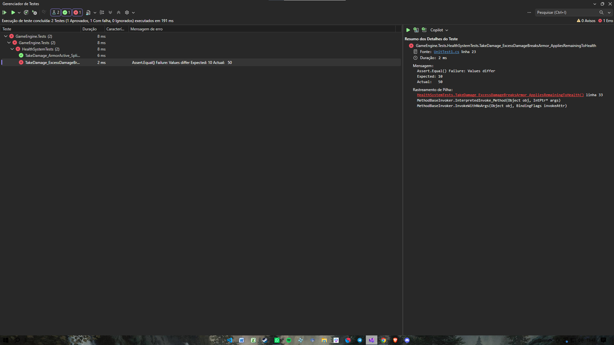
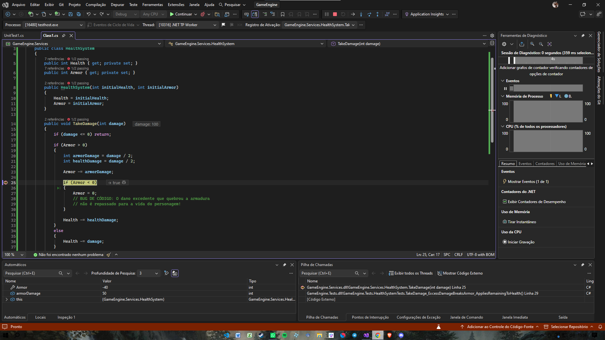
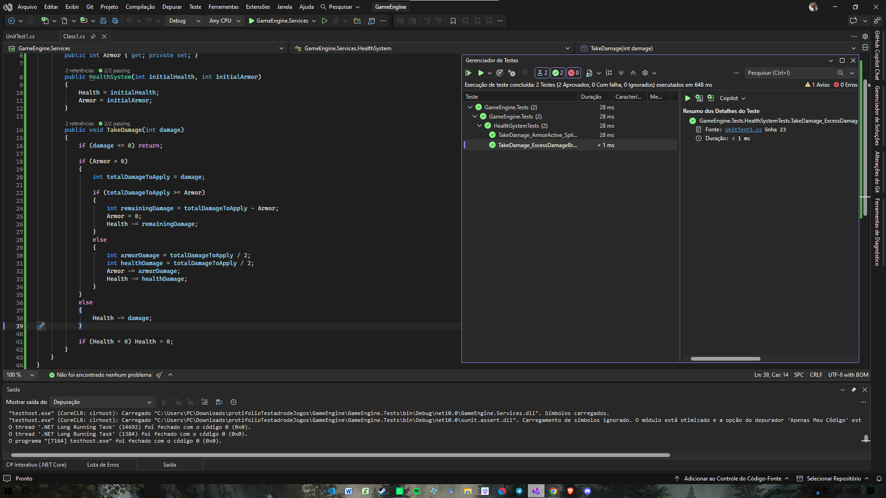

# 🎮 GameEngine - C# Technical QA & Unit Testing Suite

## 📌 Overview
This repository contains a White-Box testing suite developed in C# for a core game mechanics system (Combat, Health, and Armor handling). The goal of this project is to demonstrate unit test creation, boundary value analysis, and root cause debugging within Visual Studio.

---

## 🛠️ Technical Stack & Tools
* **Language:** C# (.NET Core)
* **IDE:** Microsoft Visual Studio
* **Testing Framework:** xUnit
* **QA Techniques:** White-Box Testing, Boundary Value Analysis, Root Cause Debugging

---

## 📸 QA Process & Test Evidences

### 1. Failure Identification (Automated Unit Test)
The automated test suite identified a calculation bug where damage exceeding the remaining armor was discarded instead of reducing the character's health.
* **Expected Result:** 10 HP
* **Actual Result:** 50 HP



---

### 2. Root Cause Analysis (Visual Studio Debugging)
In-depth inspection using execution breakpoints and variable evaluation to trace how the `Armor` variable reached negative values without carrying remaining damage to `Health`.



---

### 3. Verification & Regression Testing (Bug Fixed)
Refactored the `TakeDamage` logic to handle armor depletion correctly. Re-executed the test suite, achieving a **100% Green / Passed** status.


---

## 💻 Code Snippet: Refactored Combat Logic

```csharp
public void TakeDamage(int damage)
{
    if (damage <= 0) return;

    if (Armor > 0)
    {
        if (damage >= Armor)
        {
            int remainingDamage = damage - Armor;
            Armor = 0;
            Health -= remainingDamage;
        }
        else
        {
            Armor -= damage / 2;
            Health -= damage / 2;
        }
    }
    else
    {
        Health -= damage;
    }

    if (Health < 0) Health = 0;
}
